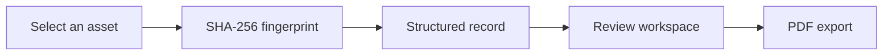
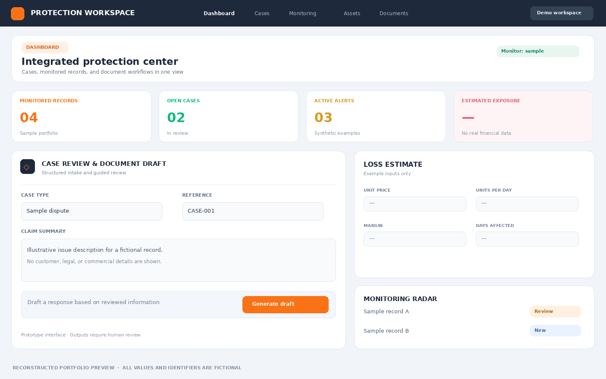

# Digital Asset Protection Workspace

**Type:** Full-stack product prototype · **Status:** In development

### The challenge

Teams managing brands and creative assets need a clear way to organize records, track issues, and preserve evidence. The product explores a unified workspace for those tasks without requiring users to navigate several disconnected tools.

### My approach

I organized the experience into distinct workflows for an asset portfolio, issue tracking, monitoring views, and document preparation. A file registration flow calculates a cryptographic hash and presents a record that can be revisited and exported.

### Engineering work

The prototype includes a web interface, authenticated areas, application endpoints, structured records, and PDF generation. The case is about designing a usable workflow and handling data carefully; it does not claim that a generated document proves legal ownership or that automated monitoring has been independently validated.

### How I built it

| Layer | Technology | What it does in the prototype |
| --- | --- | --- |
| Interface | React, TypeScript, Tailwind CSS | Builds the portfolio, review, monitoring, and document preparation screens. |
| Frontend tooling | Vite | Serves and builds the client application. |
| Application API | Node.js, Express | Organizes server-side endpoints for the workspace. |
| Identity and records | Firebase | Supports authenticated areas and structured application data. |
| File fingerprint | Client-side SHA-256 | Produces a hash for a selected file as part of the registration flow. |
| Output | PDF generation | Creates exportable documents from the prototype workflow. |

I structured the workspace around a sequence users can follow: register an asset, review a record or issue, then prepare an export. The file hash is a technical fingerprint of the selected bytes; it does not establish ownership or verify external claims. The dashboard brings these flows together without implying that the illustrative monitoring counts are live results.

**Engineering focus:** record integrity, access rules, separation of sample data from real data, and clear boundaries between a generated document and an independently verified legal conclusion.

### Interface reconstruction

`../assets/digital-asset-workspace.png` reconstructs the original dark dashboard structure, KPI row, and asymmetric review panels, with synthetic records and an anonymous title. It is not a screenshot of the live application.

### Current state and lessons

The product remains in development. I am separating demonstrable interface behavior from external verification and legal conclusions, while strengthening access rules and the reliability of the underlying records.
