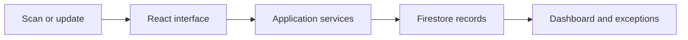
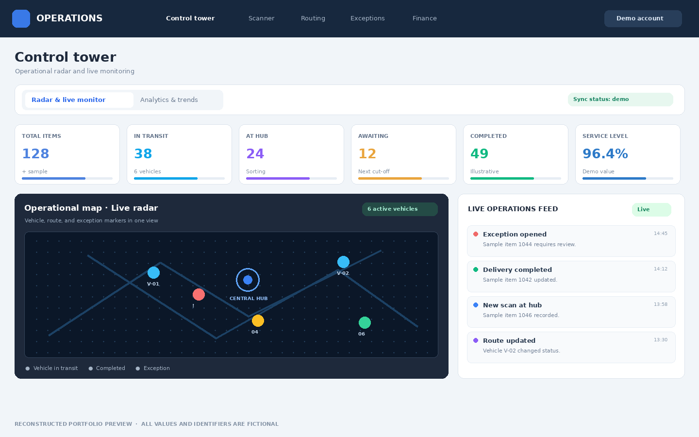

# Operations Platform Prototype

**Type:** Full-stack product prototype · **Status:** In development

### The challenge

Fast-moving operations often depend on several disconnected views of work, making it harder to understand what needs attention and act consistently. The product explores how a single workspace can bring scanning, status tracking, exceptions, and operational oversight into one flow.

### My approach

I designed an application experience around the operator's daily tasks: a quick path to record an item, a dashboard for monitoring work, and focused views for exceptions and follow-up. The interface makes state changes visible and gives different users a clearer view of the same process.

### Engineering work

The prototype combines a web interface, application services, authentication, and data synchronization. I am working through access control, consistent event handling, and deployment concerns as the product moves beyond its initial demonstration flows.

### How I built it

| Layer | Technology | What it does in the prototype |
| --- | --- | --- |
| Interface | React, TypeScript, Tailwind CSS | Composes the operational dashboard, scanning flow, status views, and reusable UI components. |
| Frontend tooling | Vite | Runs the development workflow and builds the client application. |
| Application API | Node.js, Express | Provides server-side routes for application workflows and integrations. |
| Identity and records | Firebase Authentication, Firestore | Supports signed-in experiences and stores operational records. |

The interface begins with task-focused views: capture an event, see the current state, and find an exception. React components render those views; application services and Firestore carry the corresponding records. The dashboard brings the resulting signals into one place. The radar and activity feed shown in the preview contain illustrative data.

**Engineering focus:** authorization by organization, reliable event processing, scanner behavior when connectivity is interrupted, and deployment boundaries. These are active development areas, not completed production guarantees.

### Interface reconstruction

`../assets/operations-platform.png` reconstructs the original interface structure, including the KPI row, operational radar, and activity feed, with synthetic records and an anonymous title. It is not a screenshot of the live application.

### Current state and lessons

This is an active prototype, not a claim of production deployment or measured operational improvement. The strongest lesson so far is to treat authorization, reliable state transitions, and realistic test data as product requirements from the start.
