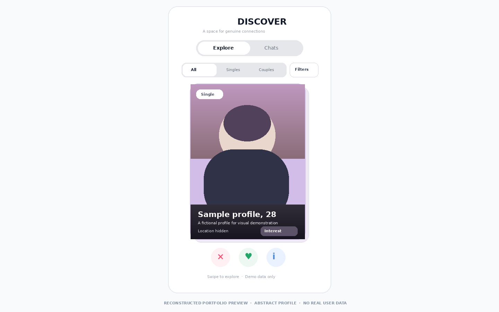

# Social Discovery Prototype

**Type:** Interactive web prototype · **Status:** Early development

### The challenge

A discovery experience must help people express preferences, explore compatible profiles, and move into conversation while giving them control over personal information.

### My approach

I built an interactive flow for profile presentation, filtering, discovery, matches, and chat. The interface uses responsive components and handles loading and error states so the core journey can be evaluated before a broader release.

### Engineering work

The prototype connects interface components to stored profile and interaction data. It currently includes a simulated signed-in user and sample data. Authentication, consent, moderation, and access rules require further work before real users should rely on it.

### How I built it

| Layer | Technology | What it does in the prototype |
| --- | --- | --- |
| Interface | React, TypeScript | Builds the responsive discovery, profile, match, and conversation views. |
| Frontend tooling | Vite | Runs the development environment and creates the client build. |
| Interaction | Motion | Animates card transitions and feedback in the discovery flow. |
| Records | Firebase, Firestore | Stores prototype profile and interaction data. |
| Application API | Node.js, Express | Provides server-side application routes. |
| Device capability | Browser geolocation | Supports location-aware interaction where permission is granted. |

I began with the core journey: choose a discovery filter, inspect a profile, take an action, and continue toward a match or conversation. The interface is built from reusable card and navigation components. Motion makes state changes legible. Stored data supports the prototype, while a simulated signed-in user and seeded examples allow the flow to be evaluated.

**Engineering focus:** real authentication, consent, moderation, location privacy, and authorization for profile and message data before a public release.

### Interface reconstruction

`../assets/social-discovery.png` reconstructs the original mobile discovery layout, filters, profile card, and actions, using an abstract profile and synthetic details. It is not a screenshot of the live application.

### Current state and lessons

This is a prototype, not a live social platform. It highlights the need to design privacy and abuse prevention alongside the core interaction, especially when profiles, location, and messages are involved.
